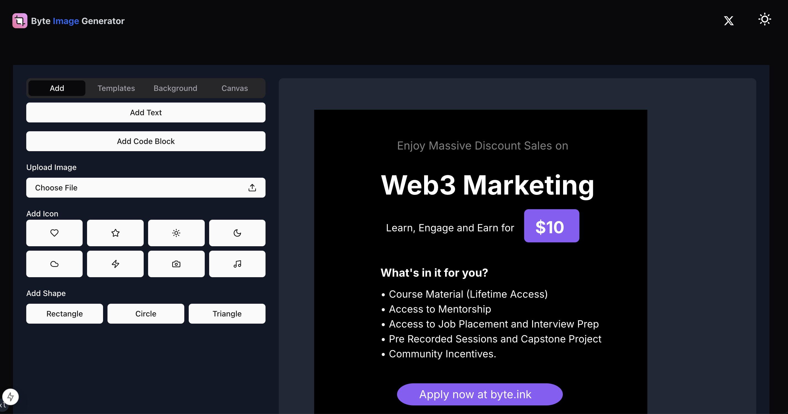

# Byte Image Generator

A modern image generation tool built with Next.js 14+ and TypeScript. Easily create images with various styles.

[](https://github.com/shadowDragons/image-generator)

⭐ If you find this project useful, please consider giving it a star on GitHub! Your support helps us grow and improve the project.

[English](README.md) | [中文](README-zh.md)



## Features

- 🎨 Multiple background templates (solid colors, gradients, patterns)
- 🖼️ Custom image generation
- 🌈 Rich color customization options
- 📏 Multiple image size options
- 🌓 Dark/Light mode support
- 🌍 i18n support (English & Chinese)
- 📊 Google Analytics integration
- 💅 Responsive design with Tailwind CSS

## Demo

Visit [https://image-generator.tool.vin](https://image-generator.tool.vin) to see the live demo.

## Quick Start

### Deploy on Vercel

[](https://vercel.com/new/clone?repository-url=https://github.com/shadowDragons/image-generator)

### Local Development

1. Clone the repository

```bash
git clone https://github.com/shadowDragons/image-generator.git
cd image-generator
```

2. Install dependencies

```bash
npm install
# or
yarn install
# or
pnpm install
```

3. Create environment variables file

```bash
cp .env.example .env.local
```

4. Start the development server

```bash
npm run dev
# or
yarn dev
# or
pnpm dev
```

Open [http://localhost:3000](http://localhost:3000) with your browser to see the result.

## Environment Variables

Create a `.env.local` file in the root directory with the following variables:

```env
NEXT_PUBLIC_GOOGLE_ID=your-ga-id
```

## Tech Stack

- [Next.js 14](https://nextjs.org/) - React framework
- [TypeScript](https://www.typescriptlang.org/) - Type safety
- [Tailwind CSS](https://tailwindcss.com/) - Styling
- [next-themes](https://github.com/pacocoursey/next-themes) - Theme management
- [html2canvas](https://html2canvas.hertzen.com/) - Image generation
- [React DnD](https://react-dnd.github.io/react-dnd/) - Drag and drop functionality

## Project Structure

```
.
├── app/          # Next.js app directory
├── components/   # React components
├── config/       # Site configuration
├── lib/          # Utility functions
├── public/       # Static assets
├── styles/       # Global styles
└── types/        # TypeScript type definitions
```

## Contributing

We welcome contributions! Please feel free to submit a Pull Request. For major changes, please open an issue first to discuss what you would like to change.

1. Fork the repository
2. Create your feature branch (`git checkout -b feature/AmazingFeature`)
3. Commit your changes (`git commit -m 'Add some AmazingFeature'`)
4. Push to the branch (`git push origin feature/AmazingFeature`)
5. Open a Pull Request

## License

This project is licensed under the MIT License - see the [LICENSE](LICENSE) file for details.

## Author

Junexus ([https://sphrag.com](https://sphrag.com))

## Support

If you find this project helpful, consider buying me a coffee:

[](https://sphrag.com/en/sponsor)

## Roadmap

- [ ] More image templates
- [ ] Custom font support
- [ ] Image filter effects
- [ ] Batch generation
- [ ] Image compression optimization
- [ ] More social media size support

## Acknowledgments

- [Next.js](https://nextjs.org/)
- [Tailwind CSS](https://tailwindcss.com/)
- [Radix UI](https://www.radix-ui.com/)
- [html2canvas](https://html2canvas.hertzen.com/)
